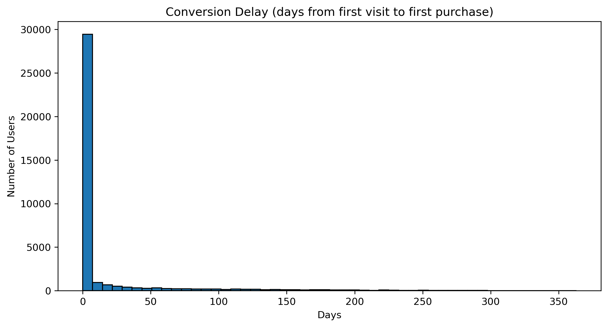
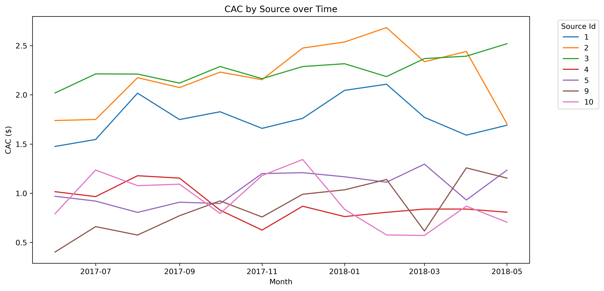
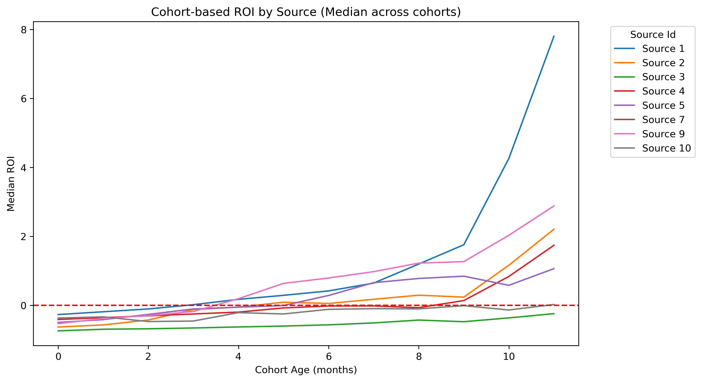

# Yandex.Afisha Marketing & Cohort Analysis

> Sprint 9 (TripleTen) • Cohort retention, CAC/LTV/ROMI, payback by channel


---

## Overview
This repository contains an end-to-end analysis of **Yandex.Afisha** performance with a focus on:
- acquisition efficiency (**CAC**),
- user economics (**LTV**, **ROMI/ROI**),
- cohort behavior (**retention**, **payback**),
- timing of the first purchase (**conversion delay**).

All analysis is implemented in **`notebook.ipynb`** using **Python (Pandas/NumPy/Matplotlib/Seaborn)**.

---

## Project Structure
```
 .
  │── notebook.ipynb
  │── README.md
  │── requirements.txt
  │── .gitignore
  │── orders_log_us.csv
  │── visits_log_us.csv
  │── costs_us.csv
  └── images/
      │── conversion_delay.png
      │── cac_by_source.png
      │── roi_curves_median.png
```

---

## Data
The project uses three CSV files (small, cleaned subsets for educational purposes):

- **`visits_log_us.csv`** — user sessions  
  Typical columns: `User Id`, `Region`, `Device`, `Start Ts`, `End Ts`, `Source Id`.

- **`orders_log_us.csv`** — orders and revenue  
  Typical columns: `User Id`, `Event Name`, `Start Ts`, `End Ts`, `Tickets`, `Revenue`.

- **`costs_us.csv`** — monthly marketing spend  
  Typical columns: `dt`, `Channel/Source Id`, `costs`.

> Exact typing/cleaning steps are shown in the notebook.

---

## Metrics & Definitions
```
Revenue = avg purchase size × number of purchases
Number of purchases = acquired users × user-order conversion
Revenue = acquired users × revenue per visitor (RPV)
RPV = total revenue / number of visitors
Gross Profit = Revenue – Costs
CAC (Customer Acquisition Cost) = Total Marketing Costs / Number of Acquired Users
LTV (Lifetime Value) = cumulative revenue per user in a cohort over time
ROMI / ROI = LTV / CAC
ARPU = Revenue / # users
ARPPU = Revenue / # payers
Retention = retention rate by cohort month
```
---

## Analysis Workflow

1. **Preprocessing** — typing, datetime parsing, sanity checks.  
2. **Conversion Delay** — time from first visit to first purchase.  
3. **CAC by Channel** — spend vs acquired users over time.  
4. **Cohort Analysis** — retention & revenue accumulation per cohort.  
5. **Payback / ROI** — LTV vs CAC dynamics across channels.

---

## Key Results (short)

- **Most first purchases happen very early** (heavy right tail, but peak in the first days).  
- **CAC varies strongly by channel**; several sources are consistently expensive.  
- **ROI/payback achieved only by selected sources**; others remain below the break-even line.  
- **Retention drops sharply after Month 1**, so growth depends on early-stage engagement and repeat purchases.

---

## Visualizations

### Conversion Delay (first visit → first purchase)


**Insight:** majority of users who will convert do so shortly after the first visit; long tails add little incremental volume.

---

### CAC by Source over Time


**Insight:** CAC dispersion is material. Budget should be re-allocated from persistently high-CAC sources to efficient ones.

---

### Cohort-based ROI by Source (median across cohorts)


**Insight:** only several sources cross **ROI = 1** within the horizon; focus on them and suppress/optimize the rest.

---

## Recommendations

- **Double-down on positive-ROI channels**; cap or test creatives/landing for weak ones.  
- **Retention first:** onboarding nudges, email/push, bundles, loyalty mechanics within Month 1.  
- **Shorten conversion delay:** remarketing within first 72 hours; targeted promos for “warm” visits.

---

## How to Run

### 1) Environment
Create a virtual environment and activate it:

```bash
python -m venv .venv
# Windows:
.venv\Scripts\activate
# macOS/Linux:
source .venv/bin/activate
# Install dependencies:
pip install -r requirements.txt
# Launch Jupyter
jupyter notebook
```

Open notebook.ipynb, then Kernel → Restart & Run All.
The notebook saves plots to images/ with the exact filenames used in this README.

## Reproducibility Notes

All random-free; results are deterministic given the CSV inputs.
Time zones and datetime parsing are handled explicitly in the notebook.
Figures are generated with Matplotlib and saved via plt.savefig(...).

## Contact
Feel free to reach out for collaboration or questions:

- LinkedIn: [Mikhail Savluchinskii](https://www.linkedin.com/in/mimisa)
- Email: mimisa.isr@gmail.com
- GitHub: [misamimisa](https://github.com/misamimisa)